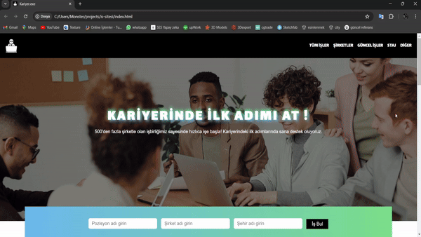
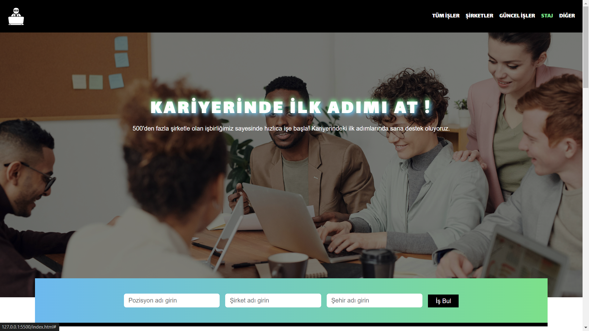
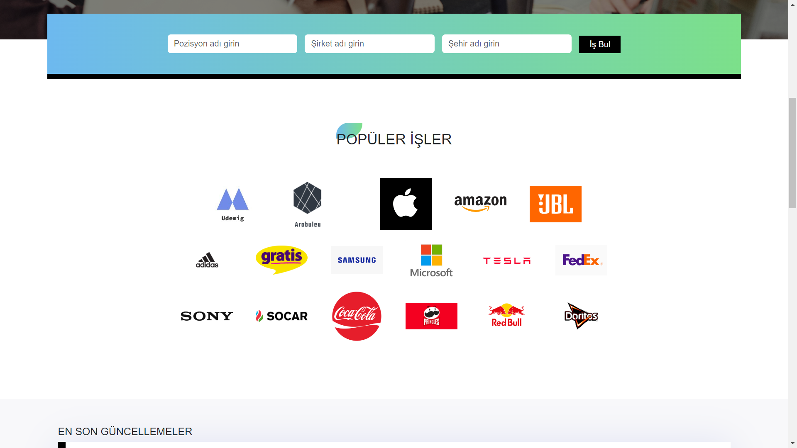
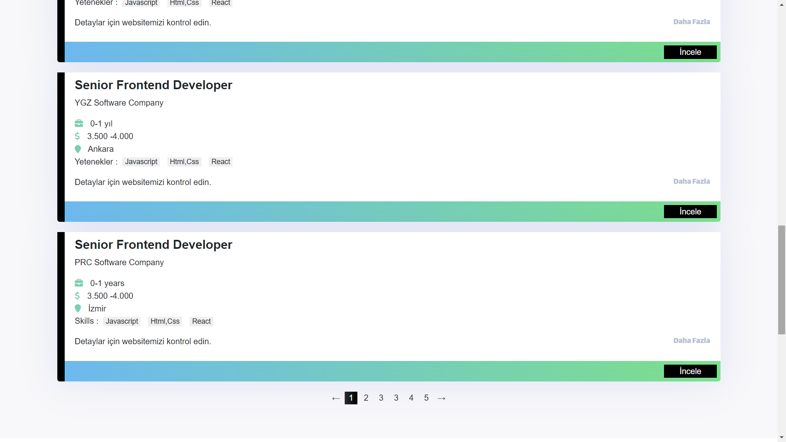
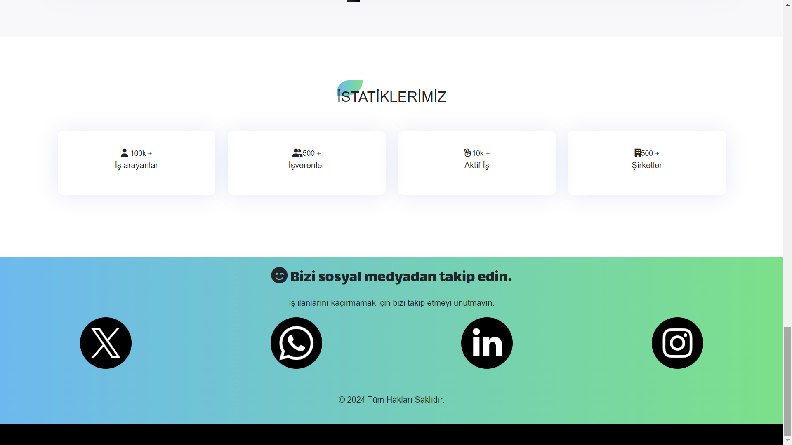

## İş İlanı Sitesi

**Başlık:** Kariyer.exe

**Açıklama:** Bu web sitesi, [Ders Adı] dersi için hazırlanmış bir proje ödevinden oluşmaktadır.

Tek sayfadan oluşan bu web sitesi, maviden yeşile geçişli bir renk paleti ile tasarlanmıştır. Bu renk paleti, sakin ve modern bir atmosfer oluşturmayı amaçlamaktadır.

**Logo:**

**Genel Görsel:**

**Temel Bilgiler:**

* **Tasarım:** Sitemiz responsive bir tasarıma sahip ve tek sayfadan oluşuyor.
* **Renk Paleti:** Genel renk maviden yeşile gradient geçişli bir renkte olup siyah renkte tamamlayıcı renge sahiptir.
* **Kullanılan Teknolojiler:**
    * HTML
    * CSS

**Genel Görsel:**
## Giriş Ekranı

## Markalar

## İlanlar

## İstatikler

* **Tasarım:** Sitemiz responsive bir tasarıma sahip ve tek sayfadan oluşuyor.
* **Renk Paleti:** Genel renk maviden yeşile gradient geçişli bir renkte olup siyah renkte tamamlayıcı renge sahiptir.
* **Kullanılan Teknolojiler:**
    * HTML
    * CSS
    * JavaScript

**Ek Özellikler:**

* Ürün ekleme ve düzenleme
* Sepet ve ödeme sistemi
* Kullanıcı oturum açma

**Renkler:**

